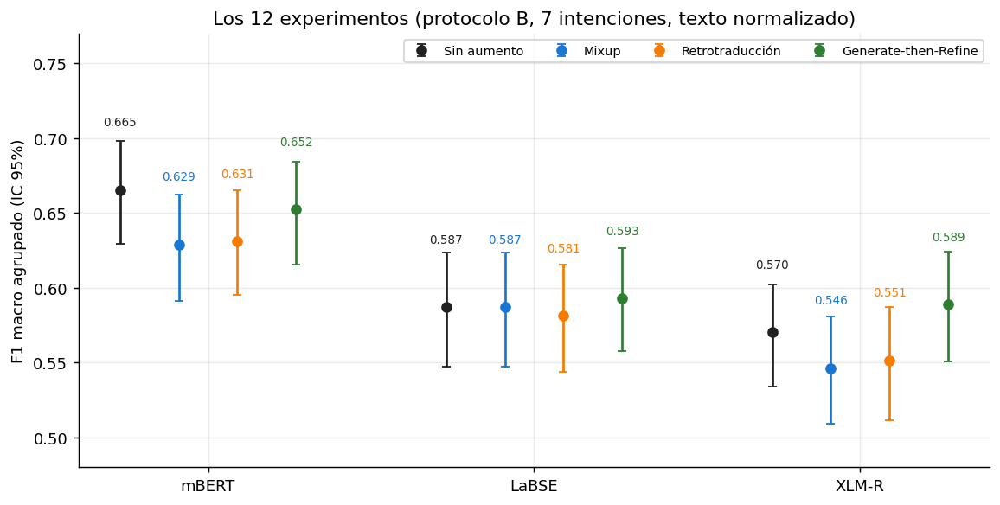
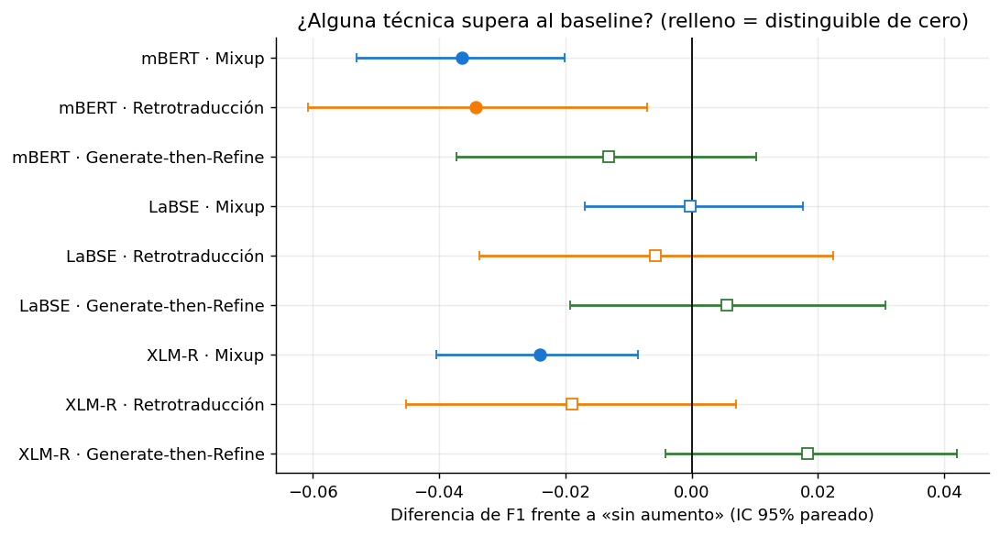
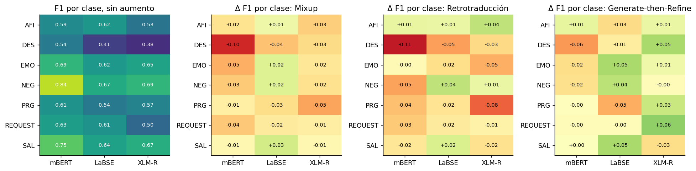
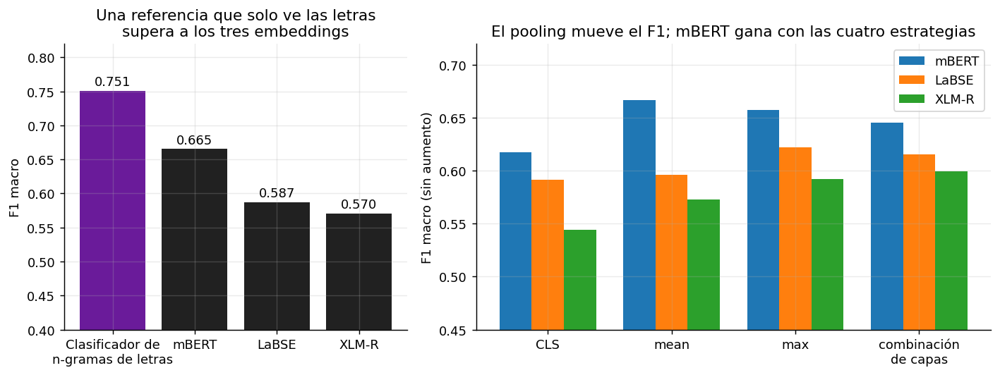
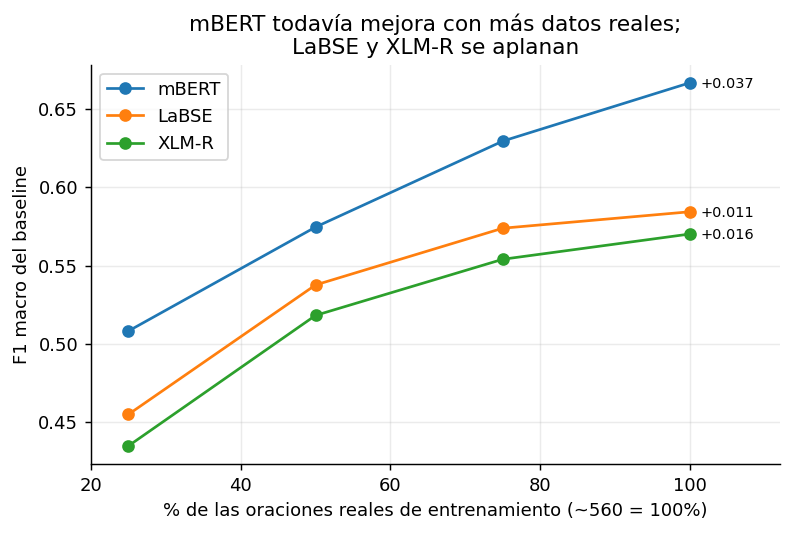
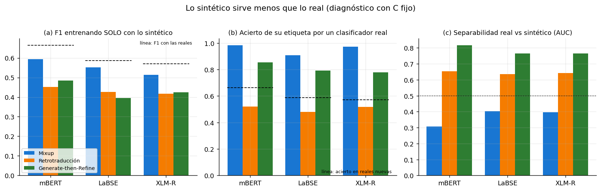
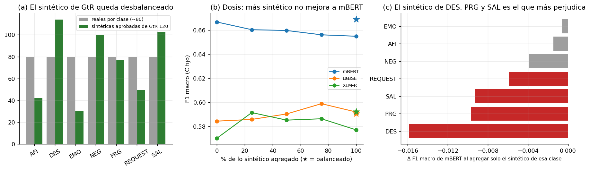
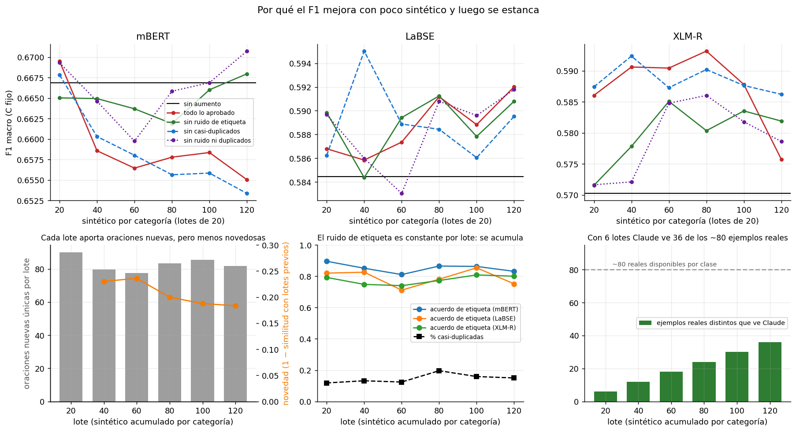
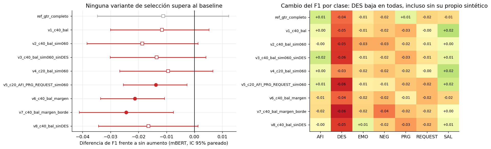
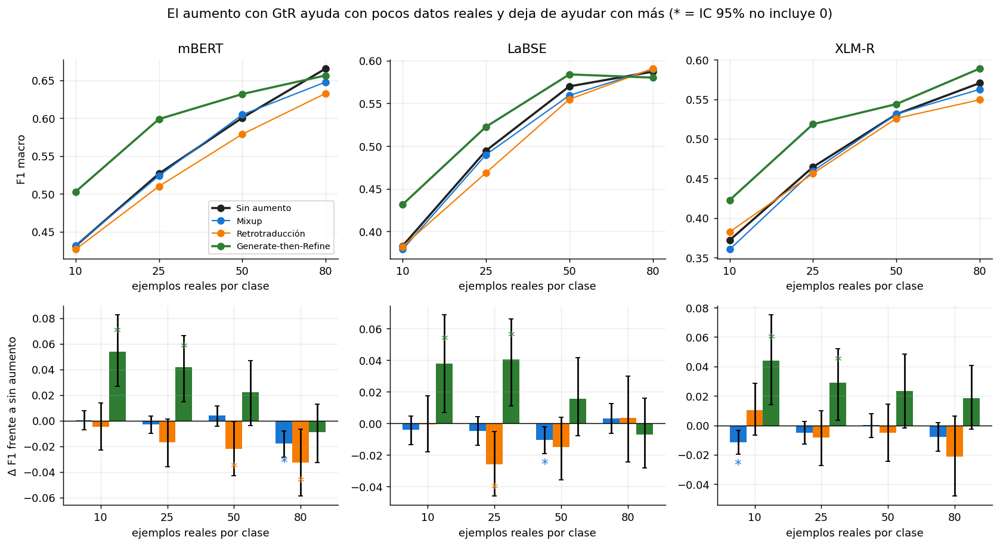

# Los 12 experimentos del OE2: conclusiones y su sustento

Todo lo que se afirma aquí sale de resultados que están en el repositorio; las figuras se regeneran con [`generar_figuras.py`](generar_figuras.py).
Cada conclusión indica **qué evidencia la sostiene y qué tan fuerte es**.

## 0. Resumen

1. **Con todos los datos de entrenamiento, ninguna técnica de aumento supera al baseline** en ninguno de los tres modelos (diferencias pareadas no distinguibles de cero, o negativas).
2. **El mejor resultado es mBERT sin aumento (F1 0.665).** mBERT supera a LaBSE y XLM-R de forma distinguible.
3. **La causa del punto 2:** en este corpus la intención se reconoce sobre todo por la forma de las letras (sufijos y partículas), y mBERT es el modelo que más conserva esa forma.
4. **La causa del punto 1:** lo sintético vale menos que lo real (se distingue de lo real, es demasiado fácil o ruidoso, y está desbalanceado), y el baseline de mBERT todavía mejora con datos *reales*.
5. **Pero el aumento sí ayuda con pocos datos:** con 10 y 25 ejemplos reales por clase, Generate-then-Refine (GtR) mejora a los tres modelos de forma distinguible (+0.03 a +0.05); la ventaja se desvanece con 50 y desaparece con 80.
6. **Mixup y Retrotraducción no ayudan en ningún régimen;** Retrotraducción además empeora.
7. **El F1 mejora con los primeros 20–40 sintéticos por categoría y luego se estanca** (sección 5.5): no es sobre todo ruido sino un límite de información (Claude solo ve 36 de ~80 ejemplos reales por clase y los lotes siguientes repiten lo ya generado); el ruido de etiqueta (entre el 10% y el 29% de cada lote, según el modelo) explica la leve caída de mBERT, y la redundancia no influye.
8. **Seleccionar mejor el sintético (balancear, filtrar por similitud o por centroides, quitar DES) no hace que GtR supere al baseline con todos los datos** (8 variantes con mBERT, ninguna mejora; la mejor, 0.656 contra 0.665; sección 5.6). La caída de DES ocurre incluso sin su propio sintético.

## 1. Qué se evaluó

| | |
|---|---|
| Datos | 700 oraciones shiwilu, 7 intenciones (100 por clase), texto normalizado (minúsculas, sin puntuación, sin tildes) |
| Modelos | LaBSE, mBERT, XLM-R, con embeddings **congelados** |
| Clasificador | Regresión Logística |
| Validación | 5 folds congelados, agrupados por texto; el test de cada fold no se toca |
| Elección de C (protocolo B) | CV interna K=5 sobre el pool de entrenamiento; el aumento de cada partición se genera **solo con su entrenamiento** |
| Técnicas | Sin aumento · Mixup (100% de las reales) · Retrotraducción (~83%) · GtR con 120 por categoría (~89%) |
| Métrica | F1 macro sobre las 700 predicciones, con IC 95% por bootstrap; diferencias pareadas sobre las mismas oraciones |

## 2. Resultados

| Modelo | Sin aumento | Mixup | Retrotraducción | GtR 120 |
|---|---|---|---|---|
| mBERT | **0.665** [0.629–0.698] | 0.629 [0.591–0.662] | 0.631 [0.595–0.665] | 0.652 [0.616–0.684] |
| LaBSE | 0.587 [0.547–0.623] | 0.587 [0.547–0.624] | 0.581 [0.544–0.615] | 0.593 [0.558–0.626] |
| XLM-R | 0.570 [0.534–0.602] | 0.546 [0.509–0.581] | 0.551 [0.511–0.587] | 0.589 [0.550–0.624] |

## 3. Conclusión 1: ninguna técnica supera al baseline con todos los datos

**Evidencia (fuerte):** las diferencias pareadas frente a «sin aumento». Un punto relleno es distinguible de cero; un punto hueco, no.

| Técnica | mBERT | LaBSE | XLM-R |
|---|---|---|---|
| Mixup | **−0.036** [−0.053, −0.020] | 0.000 [−0.017, +0.018] | **−0.024** [−0.040, −0.009] |
| Retrotraducción | **−0.034** [−0.061, −0.007] | −0.006 [−0.034, +0.022] | −0.019 [−0.045, +0.007] |
| GtR 120 | −0.013 [−0.037, +0.010] | +0.006 [−0.019, +0.031] | +0.018 [−0.004, +0.042] |

- **No hay ninguna mejora distinguible.** Las tres diferencias significativas son negativas (Mixup en mBERT y XLM-R, Retrotraducción en mBERT).
- **GtR es la técnica menos mala:** no empeora a ningún modelo de forma distinguible, y es la única con diferencias positivas (LaBSE, XLM-R), aunque con intervalos que incluyen el cero. Su AUC macro es el más alto en los tres modelos (mBERT 0.907 contra 0.899; LaBSE 0.878 contra 0.868; XLM-R 0.868 contra 0.853), sin prueba de significancia.
- **Con 80 y 40 por categoría, GtR da lo mismo** (mBERT 0.650 en ambos): más volumen no ayuda.
- **Por clase** (figura 8): los cambios son mixtos y chicos; el mayor perjuicio es sobre DES (mBERT: Mixup −0.10, Retrotraducción −0.11, GtR −0.06).

**Una precaución sobre los protocolos.** Con el protocolo anterior (C elegido en ~90 oraciones), GtR parecía mejorar a XLM-R (+0.037); con el protocolo B baja a +0.018 y deja de ser distinguible, porque el baseline de XLM-R sube de 0.548 a 0.570 al elegirle bien C.
Es decir, parte de lo que parecía mejora era un baseline mal ajustado. Por eso el protocolo B es el resultado principal.

## 4. Conclusión 2: mBERT sin aumento gana, y por qué

**Evidencia:** (a) mBERT supera a LaBSE y XLM-R con diferencias pareadas distinguibles (+0.078 y +0.095); (b) las siluetas intrínsecas del OE3 tienen el mismo orden; (c) una referencia que solo ve las letras supera a los tres modelos; (d) mBERT gana con las cuatro estrategias de pooling.

| Evidencia | Valor | Qué indica |
|---|---|---|
| Clasificador de n-gramas de **caracteres** (TF-IDF 2–5 + Regresión Logística, mismos folds y protocolo) | **F1 0.751** | La intención se reconoce sobre todo por la forma superficial (sufijos, partículas); mejor que cualquier embedding congelado |
| Silueta intrínseca, mean pooling (OE3) | mBERT −0.010, LaBSE −0.030, XLM-R −0.051 | Ningún modelo agrupa por intención, pero mBERT es el menos malo; mismo orden que el F1 |
| F1 por estrategia de pooling, sin aumento | mBERT 0.617–0.667; LaBSE 0.591–0.622; XLM-R 0.544–0.600 | mBERT gana con las cuatro; la estrategia importa (hasta 0.05) |
| Subpalabras por palabra | mBERT 3.69, XLM-R 3.52, LaBSE 3.29 | Los tres fragmentan el shiwilu mucho (3–4 trozos por palabra) |

**Cómo leerlo (interpretación, no probada causalmente):** mBERT, con mean pooling de subpalabras, conserva más la forma de las letras; LaBSE está pensado para el significado entre idiomas y en shiwilu no tiene significado conocido que capturar.
**Nota:** en LaBSE y XLM-R, la extracción «de fábrica» usada en los 12 experimentos no es la mejor (LaBSE 0.587 contra 0.622 con max pooling; XLM-R 0.570 contra 0.600 con combinación de capas), lo que reduce la brecha con mBERT (de 0.078 y 0.095 a ~0.045 y ~0.067), pero no la invierte. Elegir el mejor pooling sobre el mismo test es optimista.

## 5. Conclusión 3: por qué el aumento no mejora con todos los datos

Pruebas controladas con **C fijo** (para que la elección de C no intervenga) y lo sintético de la etapa «pool» de cada fold.

### 5.1 No es un techo de datos: mBERT todavía aprende de datos reales

| Fracción de las ~560 reales | mBERT | LaBSE | XLM-R |
|---|---|---|---|
| 25% | 0.508 | 0.455 | 0.435 |
| 50% | 0.575 | 0.538 | 0.518 |
| 75% | 0.630 | 0.574 | 0.554 |
| 100% | 0.667 | 0.584 | 0.570 |

La curva de mBERT sigue subiendo (+0.037 en el último tramo): **más datos reales lo mejorarían**. La de LaBSE y XLM-R se aplana (+0.010 y +0.016), y por eso con ellos casi no hay qué ganar. Entonces, que el aumento no ayude a mBERT no se debe a que ya no pueda mejorar.

### 5.2 Lo sintético sirve menos que lo real

| Prueba (mBERT) | GtR | Retrotraducción | Mixup |
|---|---|---|---|
| (a) F1 entrenando **solo** con lo sintético (con ~480 reales sería ~0.63) | 0.484 | 0.452 | 0.594 |
| (b) Acierto de su etiqueta por un clasificador entrenado con reales (en reales nuevas acierta 0.67) | 0.854 | **0.520** | 0.984 |
| (c) Similitud máxima con las reales: sintético / real nuevo | 0.843 / 0.848 | 0.863 / 0.848 | **0.983** / 0.848 |
| (d) AUC para distinguir real de sintético (1 = totalmente distinto) | **0.817** | 0.654 | 0.306 |

- **GtR:** se distingue de lo real (AUC 0.82). Sus etiquetas coinciden con las de un clasificador real **más** que las de oraciones reales nuevas (0.85 contra ~0.67): son ejemplos «típicos» y fáciles, con poca información sobre la frontera entre categorías.
- **Retrotraducción:** la mitad de sus etiquetas no coincide con lo que predice un clasificador real: ruido de etiqueta, coherente con que es la que más empeora.
- **Mixup:** es casi redundante (se parece a las reales mucho más que una oración real nueva); entrenar solo con él da el F1 más alto de los tres, por la misma razón.
- (La similitud de XLM-R, ≈0.999 en todo, no es informativa y no se usa en esta lectura.)

### 5.3 El sintético de GtR está desbalanceado y parte de él perjudica

- **(a) Composición:** por fold, GtR aporta DES 118, SAL 106, NEG 100, PRG 77, REQUEST 51, AFI 44 y EMO 31, frente a ~80 reales por clase. Los filtros de marcador dejan pasar casi todo DES y SAL y rechazan mucho EMO, AFI y REQUEST.
- **(b) Dosis:** en mBERT el F1 baja con la cantidad de sintético (0.667 sin sintético; 0.660, 0.660, 0.656, 0.655 con 25, 50, 75 y 100%), y con un sintético **balanceado** (mismo número por clase) vuelve a 0.669.
- **(c) Origen del daño:** al agregar solo el sintético de una clase, el que más perjudica es DES (−0.016), luego PRG (−0.010) y SAL (−0.009). El de DES, PRG, NEG y SAL **empeora a su propia categoría** (DES 0.547 → 0.504; PRG 0.609 → 0.581; NEG 0.844 → 0.806; SAL 0.764 → 0.747); el de EMO, AFI y REQUEST queda neutro o ayuda un poco. (Ver 5.6: quitar el sintético de DES del conjunto completo no recupera el F1 de DES, así que su caída no se debe solo a su propio sintético.)

### 5.4 Síntesis de la causa

Más datos reales mejorarían a mBERT, pero lo que generan las técnicas es de peor calidad (distinto de lo real, demasiado fácil o ruidoso, o redundante) y, en GtR, además desbalanceado y con una parte (DES, PRG, SAL, NEG) que daña a su propia clase.
Cada efecto por separado es chico (≤0.02) frente al ancho de los intervalos (~0.07): la evidencia es **consistente en dirección** más que significativa prueba por prueba.

### 5.5 Por qué el F1 mejora con poco sintético y luego deja de mejorar: ¿es ruido, y de qué tipo?

**Cómo se midió.** Se agregaron los lotes de GtR (20 oraciones por categoría cada uno) al pool real de cada fold **de uno en uno, de 1 a 6** (20 a 120 por categoría), con C fijo y el test intacto, y se repitió con cuatro versiones del sintético:
*todo lo aprobado*; *sin ruido de etiqueta* (se descartan las filas cuya etiqueta no coincide con la que predice un clasificador entrenado con las reales); *sin casi-duplicados* (coseno LaBSE ≥ 0.90 con otra fila ya conservada de su clase); y *sin ambos*.
Si limpiar un tipo de ruido hiciera que el F1 siguiera subiendo, ese ruido sería la causa del estancamiento.

F1 macro con todo lo aprobado, por sintético acumulado por categoría (el baseline va en la primera columna):

| Modelo | Sin aumento | 20 | 40 | 60 | 80 | 100 | 120 |
|---|---|---|---|---|---|---|---|
| mBERT | 0.667 | 0.670 | 0.659 | 0.656 | 0.658 | 0.658 | 0.655 |
| LaBSE | 0.584 | 0.587 | 0.586 | 0.587 | 0.591 | 0.589 | 0.592 |
| XLM-R | 0.570 | 0.586 | 0.591 | 0.590 | 0.593 | 0.588 | 0.576 |

**1. Qué pasa con la cantidad.** Cualquier efecto aparece con los primeros 20–40 sintéticos por categoría y después la curva se queda plana (LaBSE, XLM-R hasta 100) o baja un poco (mBERT, y XLM-R en el último punto).
Hay que leerlo con la escala en mente: **toda la curva se mueve dentro de ~0.02**, es decir, dentro del ruido de estas estimaciones; lo más sólido es la ganancia temprana de XLM-R (+0.016 a +0.023) y la caída gradual de mBERT.

**2. ¿Es ruido? En parte, y de tres tipos distintos:**

| Tipo | Cuánto hay | ¿Explica el estancamiento? |
|---|---|---|
| **Ruido de etiqueta** (la oración sintética no corresponde claramente a su clase) | En cada lote, entre el 10% y el 29% de las filas (según el modelo) no coincide con lo que predice un clasificador real (acuerdo: mBERT 0.81–0.90, XLM-R 0.74–0.81, LaBSE 0.71–0.85; DES el más bajo, ~0.73). **Es constante por lote**, así que se acumula con el volumen | **Explica la caída de mBERT**: sin esas filas, mBERT ya no baja (0.668 con 120 por categoría y entre 0.662 y 0.668 en toda la curva, contra 0.655 con todo; su baseline es 0.667). Pero queda en el nivel del baseline, **no mejora** |
| **Redundancia** (casi-duplicados y plantillas repetidas) | 12–20% de cada lote son casi-duplicados; la novedad frente a los lotes previos baja de 0.23 a 0.18; el 19% de las aprobadas repite el español dentro de su clase | **No**: quitarlos no cambia las curvas (mBERT 0.653 con 120, igual que con todo) |
| **Ruido de forma** (el shiwilu de Claude es aproximado y se distingue del real: AUC 0.82) | No se puede manipular con esta prueba | No se mide aquí; es el candidato para explicar por qué incluso el sintético «limpio» no suma nada en mBERT |

**Un matiz importante sobre el «ruido de etiqueta».** El filtro quita lo que el clasificador no reconoce, y eso mezcla errores reales con ejemplos *difíciles pero válidos*. En XLM-R se ve: con el filtro, la ganancia temprana desaparece (0.572 con 20 por categoría, contra 0.586 sin filtrar), lo que indica que parte de lo «discordante» es justamente información útil de frontera. Con esta prueba no se pueden separar del todo ruido y dificultad.

**3. La causa principal del estancamiento no parece ser ruido, sino un límite de información.** Con el sintético limpio de ruido de etiqueta y de duplicados, mBERT se queda plano en el nivel del baseline: más lotes de sintético limpio no aportan nada. Esto es coherente con cómo se genera:

- Cada lote le pide a Claude 20 oraciones más con el **mismo prompt** (descripción de la clase, lista de marcadores) y una **ventana de solo 6 ejemplos reales** que avanza de 6 en 6. Con 6 lotes, Claude llega a ver **36 de los ~80 ejemplos reales de cada clase** y nunca los otros ~44 (figura, panel inferior derecho).
- Cada lote sigue aportando unas 80 oraciones únicas nuevas (no se agotan), pero **cada vez más parecidas a las anteriores** (novedad de 0.23 a 0.18): más paráfrasis de la misma información, no información nueva.
- Por eso el volumen de sintético crece pero lo que sabe sobre cada clase no: **la información que entra al sintético está acotada por los ejemplos reales que Claude ve y por su conocimiento del shiwilu, no por la cantidad generada**.

**4. Resumen de lo que ocurre.** Hasta ~20–40 sintéticos por categoría, el sintético puede aportar algo (XLM-R) o ser neutro (LaBSE, mBERT). Más allá, la información no crece, así que el F1 se queda plano; y como cada lote trae la misma proporción de filas dudosas, el ruido de etiqueta se acumula y en el modelo más sensible (mBERT) produce una leve caída.

**5. Cómo comprobarlo y qué probar (no hecho aún).** La parte del límite de información es una **hipótesis respaldada por el código y las estadísticas, no probada causalmente**. Para probarla habría que regenerar el sintético con ventanas de ejemplos que recorran **todos** los ejemplos reales de cada clase (en lugar de los primeros 36) y ver si la curva se estanca más arriba (unas 210 llamadas para el pool de los 5 folds, ~US$1.7). Y para el ruido de etiqueta, un filtro específico en DES, donde el acuerdo es menor.

### 5.6 ¿Se arregla seleccionando mejor el sintético? Variantes de balanceo y filtrado (mBERT, protocolo B)

Las secciones anteriores sugerían tres remedios: balancear el sintético por clase, filtrar por calidad (similitud con LaBSE, cercanía a la clase) y quitar el sintético de DES. Se probaron ocho variantes (más dos referencias) con el **protocolo B** (C por CV interna, 2 muestras aleatorias del balanceo), desde las cachés ya generadas
(sin API; notebook `evaluacion/notebooks/variantes_gtr.ipynb`). El criterio de éxito fue F1 ≥ baseline, DES sin caer más de 0.01 y ninguna clase con caída mayor a 0.02.

| Variante | Qué hace | F1 | Dif. vs sin aumento | Dif. en DES |
|---|---|---|---|---|
| (referencia) Sin aumento | solo reales | **0.665** | — | — |
| (referencia) GtR completo | todo lo aprobado de GtR 120 | 0.654 | −0.011 | −0.042 |
| v1 | 40 por clase, balanceado | 0.654 | −0.012 | −0.046 |
| v2 | v1 con `similitud_labse` ≥ 0.60 | 0.647 | −0.019 | −0.055 |
| v3 | v2 sin sintético de DES | 0.652 | −0.013 | −0.055 |
| v4 | 20 por clase con similitud ≥ 0.60 | 0.656 | −0.009 | −0.035 |
| v5 | solo AFI, PRG y REQUEST (20 por clase, similitud ≥ 0.60) | 0.652 | **−0.014*** | −0.059 |
| v6 | 40 por clase, solo los más cerca de su clase que de otra (margen ≥ 0.05) | 0.644 | **−0.021*** | −0.045 |
| v7 | 40 por clase, del lado correcto pero cerca de la frontera | 0.641 | **−0.024*** | −0.062 |
| v8 | 40 por clase balanceado, sin DES | 0.649 | −0.016 | −0.054 |

1. **Ninguna variante supera al baseline, y ninguna cumple el criterio.** La mejor (v4, 20 por clase con similitud) queda en 0.656 (−0.009, no distinguible); tres son significativamente peores. DES cae entre 0.035 y 0.062 en todas.
2. **Balancear por sí solo no ayuda:** v1 (40 por clase) da lo mismo que GtR completo (0.654 ambos). El desbalance no era la causa principal de que GtR no mejore a mBERT.
3. **El filtro de similitud no mejora** (v2 0.647), y menos sintético (20 por clase, v4) es apenas mejor que más, en línea con la curva de dosis.
4. **Quitar el sintético de DES no recupera el F1 de DES** (v3 y v8: −0.055 y −0.054, igual o peor que con él: −0.042 y −0.046). **Esto corrige la lectura de 5.3(c):** la caída de DES no viene de su propio sintético sino de que el sintético de *las otras clases* desplaza su frontera (DES es la clase residual: sin una estructura propia, pierde casos cuando las demás se refuerzan). Agregar solo el sintético de DES lo bajaba, pero sacarlo del conjunto completo no lo arregla.
5. **Seleccionar por centroides empeora, en las dos direcciones.** El margen ≥ 0.05 es tan estricto que pasan solo ~55 oraciones por fold (EMO 0): casi no hay aumento y aun así baja (v6). Los más cercanos a la frontera (v7) tampoco ayudan: son los más ambiguos y los más ruidosos.
6. **Lo que se concluye:** con todos los datos y mBERT, **seleccionar mejor el sintético no basta.** Es coherente con 5.5: el límite es la información y la calidad de forma que Claude puede aportar, no cómo se reparte. Por eso es poco probable que regenerar con una aprobación balanceada (paso con costo en créditos) cambie el resultado a datos completos; donde sí vale probar mejoras de selección es en el régimen de pocos datos (sección 6), donde GtR sí ayuda.

Cautelas: solo mBERT; 2 muestras aleatorias (la desviación entre semillas va de 0.000 a 0.010); el C elegido es sensible a diferencias numéricas mínimas, así que **diferencias entre variantes menores a ~0.01 no son interpretables.**

## 6. Conclusión 4: con pocos datos reales, GtR sí ayuda

Se repitieron los experimentos con 10, 25, 50 y 80 ejemplos reales por clase (80 = todo el entrenamiento de un fold; con 5 folds no se puede llegar a 100). **GtR se generó de nuevo con Claude usando solo las oraciones de cada régimen** (para no contaminar el escenario con ejemplos que no existirían), con 20, 40 y 80 por categoría para 10, 25 y 50.

| Modelo · Técnica | 10 | 25 | 50 | 80 |
|---|---|---|---|---|
| mBERT · Sin aumento | 0.431 | 0.527 | 0.600 | 0.665 |
| mBERT · GtR | **0.503** | **0.599** | 0.632 | 0.656 |
| LaBSE · Sin aumento | 0.383 | 0.495 | 0.570 | 0.587 |
| LaBSE · GtR | **0.432** | **0.523** | 0.584 | 0.580 |
| XLM-R · Sin aumento | 0.372 | 0.464 | 0.531 | 0.570 |
| XLM-R · GtR | **0.423** | **0.519** | 0.544 | 0.589 |

| Diferencia de GtR frente a sin aumento | 10 | 25 | 50 | 80 |
|---|---|---|---|---|
| mBERT | **+0.054*** | **+0.042*** | +0.022 | −0.009 |
| LaBSE | **+0.038*** | **+0.040*** | +0.016 | −0.007 |
| XLM-R | **+0.044*** | **+0.029*** | +0.024 | +0.018 |

(* = IC 95% pareado no incluye 0.)

- **El patrón se repite en los tres modelos:** ayuda con 10 y 25, se reduce con 50 y desaparece con 80. Es el resultado que hace consistente la historia completa: el aumento sirve en recursos extremos y deja de servir cuando hay más datos reales.
- **Mixup y Retrotraducción no ayudan en ningún régimen** (Retrotraducción incluso empeora: mBERT −0.022* con 50 y −0.033* con 80; LaBSE −0.026* con 25).
- **Equivalencias aproximadas** (interpolando la curva del baseline): con 10 reales, ~14 sintéticas por clase valen como ~11 reales; con 25, ~26 sintéticas valen como ~25 reales; con 50, ~49 sintéticas valen como ~14 reales. **El valor de cada oración sintética cae a medida que hay más datos reales.**
- **Cautelas:** GtR usa una sola muestra de reales por régimen (el baseline de mBERT varía hasta ±0.046 entre muestras con 10 por clase, y la comparación de GtR es pareada con la misma muestra); el C es común a las cuatro técnicas y se elige con las reales; la interpolación de equivalencias es aproximada.

## 7. Conclusión 5: DES es la clase débil y gran parte del problema es de etiqueta

- DES es la categoría con menor F1 en los tres modelos (mBERT 0.54, LaBSE 0.41, XLM-R 0.38); si llegara al promedio de las demás, el F1 macro subiría 0.02 a 0.03.
- **Origen:** la metodología del corpus indica que las flashcards se etiquetaron con reglas de expresiones regulares y **DES era la clase residual** («si ningún patrón coincide»). 24 de sus 100 oraciones las clasifican mal los tres modelos, y se solapan con REQUEST, EMO y AFI (p. ej. «Termine esto», «Quiero más», «Puedes entrar», frente a «Necesito descansar» etiquetada REQUEST).
- **Reetiquetar con criterio semántico (25 oraciones) no mejora el F1** (mBERT 0.665 → 0.638): las oraciones movidas se clasifican bien con su etiqueta nueva solo el 24–36% de las veces. No es un problema que se resuelva corrigiendo etiquetas a ojo.
- **Quitar DES** sube el F1 (mBERT 0.665 → 0.702; LaBSE 0.587 → 0.659; XLM-R 0.570 → 0.663), en parte porque es un problema más fácil; no cambia la conclusión sobre el aumento (ninguna técnica supera al baseline).
- Detalle y listas de oraciones: `oe2_aumento_de_datos/analisis_intrinseco/resultados/auditoria_des/`.

## 8. Conclusión 6: sensibilidad a decisiones de protocolo

- **Elegir C importa.** El protocolo A (C en ~90 oraciones) y el B (CV interna, 5 particiones) dan baselines distintos (XLM-R 0.548 contra 0.570) y cambian la lectura de GtR. Además, el C elegido es sensible a diferencias numéricas mínimas (Colab/Linux frente a Windows): una recomputación local de GtR dio 0.654 en lugar de 0.652 (4 de 5 folds eligen el mismo C). **Diferencias entre configuraciones menores a ~0.005 no son interpretables.**
- **Signos de interrogación.** Conservar `¿?` sube el F1 macro 0.07–0.10 (mBERT 0.665 → 0.735), casi todo por PRG (F1 ≈ 1.0, porque el 100% de PRG los lleva) y AFI. No se usa como resultado principal porque convierte PRG en una detección trivial; con texto de voz no estarían disponibles.

## 9. Qué se puede afirmar y qué no

| Afirmación | Sustento |
|---|---|
| Con todos los datos, ninguna técnica mejora al baseline | **Fuerte** (pareadas, protocolo B, 3 modelos, además de varias pruebas de apoyo) |
| mBERT sin aumento es el mejor resultado | **Fuerte** |
| mBERT gana porque conserva más la forma de las letras | **Media**: coherente con 4 evidencias, pero no probada causalmente |
| Lo sintético vale menos que lo real (distinto, fácil o ruidoso, desbalanceado) | **Media**: pruebas con C fijo; efectos individuales ≤0.02 |
| El sintético de DES, PRG, SAL y NEG perjudica a su propia clase | **Media-baja**: diferencias pequeñas, sin significancia por prueba |
| GtR ayuda con 10–25 ejemplos reales por clase | **Fuerte** en dirección (3 modelos, 2 regímenes, todos distinguibles); con una sola muestra de reales por régimen |
| La calidad (y no la cantidad) limita al sintético | **Media**: consistente con la caída del valor por oración, pero no hay evaluación de un hablante |
| El F1 se estanca porque la información del sintético no crece con el volumen (más que por ruido) | **Media-baja**: respaldada por el diseño del generador y por las curvas (limpiar ruido y duplicados no la cambia), pero no probada causalmente; todo se mueve dentro de ~0.02 |
| El ruido de etiqueta (10–29% de cada lote) explica la leve caída de mBERT al agregar más sintético | **Media**: la caída desaparece al quitarlo; el filtro mezcla errores reales con ejemplos difíciles |
| Balancear, filtrar o quitar DES no basta para que GtR supere al baseline con todos los datos | **Media**: 8 variantes, todas en la misma dirección, pero solo mBERT, 2 muestras y diferencias < 0.01 no interpretables |
| La caída de DES con GtR no se debe solo a su propio sintético | **Media**: persiste sin él (v3, v8) |
| Las oraciones sintéticas son shiwilu gramatical | **No evaluado**: requiere un hablante |

## 10. Respuesta a la hipótesis de la tesis

> *«Los baselines con aumento de datos tienen mejores resultados que los baselines solos.»*

**No se sostiene en el escenario de datos completos** (~560 oraciones reales de entrenamiento por fold, ~80 por clase), y **sí se sostiene para GtR en el escenario de recursos extremos** (10–25 ejemplos reales por clase), donde mejora de forma distinguible a los tres modelos. Las otras dos técnicas (Mixup y Retrotraducción) no ayudan en ningún régimen.

Redacción sugerida: *«El aumento de datos con Generate-then-Refine mejora de forma consistente la clasificación de intenciones cuando se dispone de muy pocos ejemplos reales (10–25 por clase), pero su beneficio se desvanece al aumentar los datos reales; con el corpus completo, el baseline sin aumento con mBERT es el mejor resultado.»*

## 11. Dónde está cada evidencia

| Evidencia | Ruta |
|---|---|
| 12 experimentos, pareadas, ROC | `evaluacion/resultados/cv_interna/` (archivos `*_c120.csv`) |
| Curva de aprendizaje real, utilidad de lo sintético, dosis, n-gramas | `evaluacion/diagnostico_baseline/` |
| Curva por régimen | `evaluacion/resultados/curva_regimen/` y `tecnicas_aumento/salidas/regimenes/` |
| Estancamiento con la cantidad de sintético (sección 5.5) | `evaluacion/diagnostico_baseline/por_que_se_estanca.py` y `resultados/E_*.csv` |
| Silueta y F1 por pooling | `../oe3_caracterizacion_embeddings/` |
| Auditoría de DES | `analisis_intrinseco/resultados/auditoria_des/` |
| Variantes de selección de GtR (sección 5.6) | `evaluacion/variantes_gtr.py`, `evaluacion/notebooks/variantes_gtr.ipynb` y `evaluacion/resultados/variantes_gtr/` |
